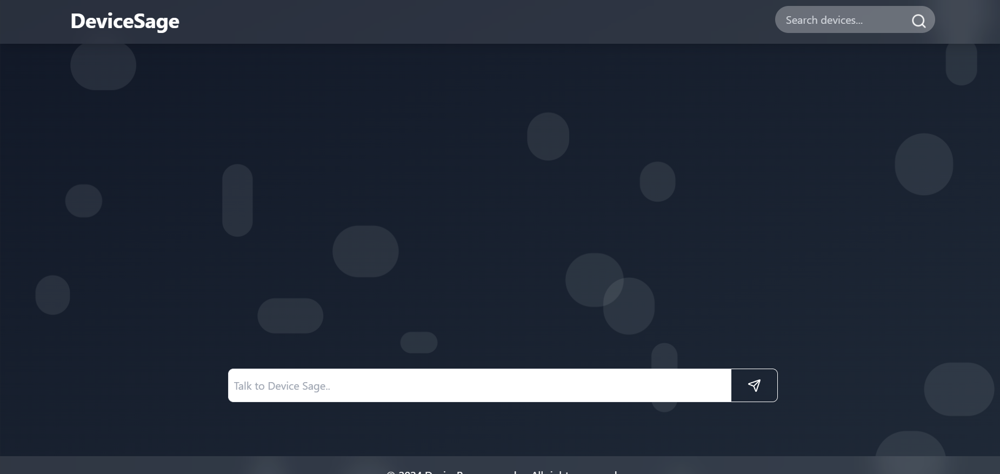

# Device Recommendation System

This project is a **Device Recommendation System** that helps users choose the most suitable device based on their preferences and answers to a set of questions. The system uses a **Django** backend for handling requests, interacting with a **MySQL** database, and rendering pages to users.

##Preview



## Features

- User-friendly interface to ask a series of questions to gather device preferences.
- Dynamic device recommendation based on user inputs.
- Integration with a MySQL database to store and retrieve device information.
- Responsive design using **TypeScript** and **Tailwind CSS**.
- Admin panel for managing device data.
- Ability to filter and sort devices based on specifications like price, brand, RAM, and other technical specifications.

## Tech Stack

- **Backend**: Django (Python framework)
- **Frontend**: TypeScript, Tailwind CSS
- **Database**: MySQL
- **Deployment**: Git

## Installation

Follow these steps to set up the project locally:

### Prerequisites

- Python 3.8 or higher
- MySQL
- Node.js and npm (for TypeScript and Tailwind CSS)
- Git


## Project Structure

```
device-recommendation/
│
├── frontend/                 # Frontend files (TypeScript, Tailwind CSS)
│   ├── src/                  # Source code for the frontend
│   ├── dist/                 # Compiled frontend assets
│   └── package.json          # Node.js configuration file
│
├── device_recommendation/     # Django project settings
│   ├── settings.py           # Django settings
│   ├── urls.py               # URL routing
│   ├── views.py              # Views for rendering templates
│   ├── models.py             # Database models
│   └── templates/            # HTML templates
│
├── device/                   # Device app handling recommendations
│   ├── migrations/           # Database migrations
│   ├── models.py             # Models for device data
│   ├── views.py              # Business logic for recommendations
│   └── urls.py               # URL routing for device app
│
├── manage.py                 # Django project management script
├── requirements.txt          # Python dependencies
├── .gitignore                # Ignored files (e.g., .env, node_modules)
└── README.md                 # Project documentation
```

## Usage

1. **Device Recommendation**:
   Users will be prompted with a series of questions. Based on their preferences (e.g., price, brand, RAM, etc.), the system will recommend devices that match their criteria.


